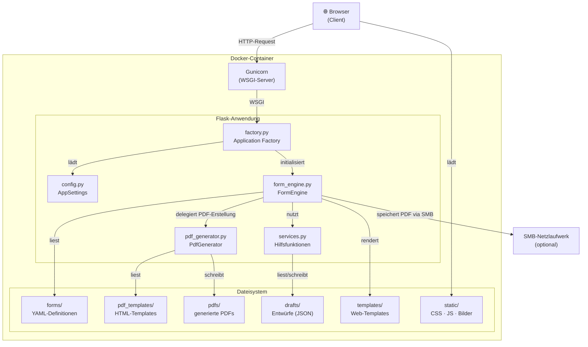
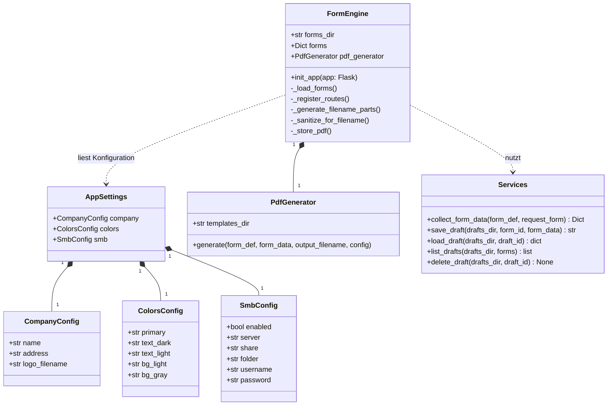
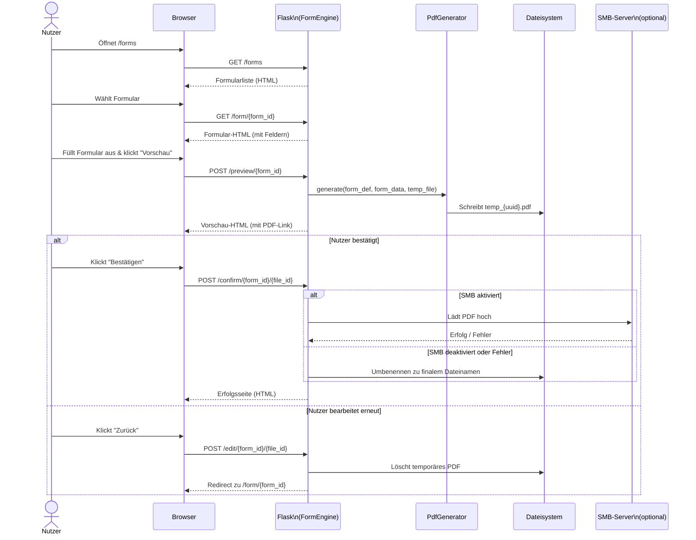
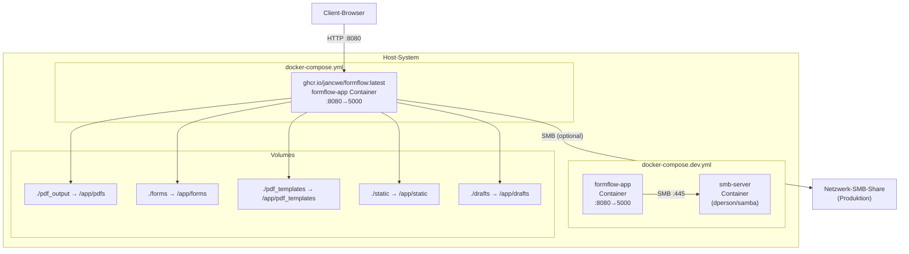
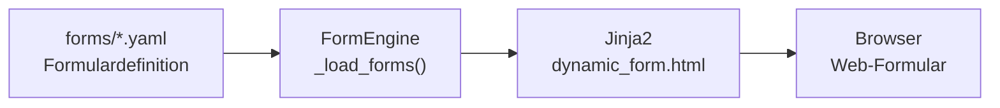
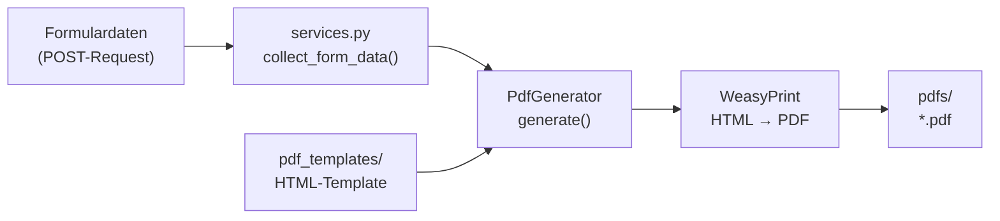
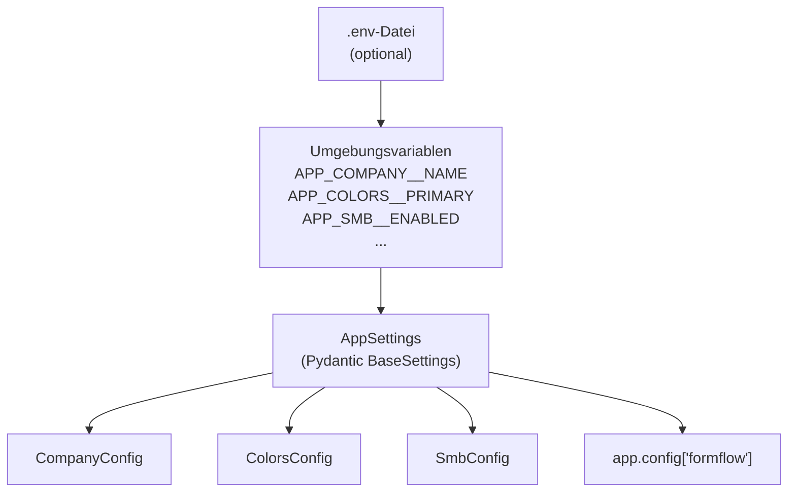

# Architektur

Dieser Artikel beschreibt die technische Architektur der **formflow**-Webanwendung nach gängigen Software-Engineering-Standards.

---

## Inhaltsverzeichnis

1. [Überblick](#1-überblick)
2. [Schichtenarchitektur](#2-schichtenarchitektur)
3. [Komponentendiagramm](#3-komponentendiagramm)
4. [Klassendiagramm](#4-klassendiagramm)
5. [Sequenzdiagramm – Formular einreichen](#5-sequenzdiagramm--formular-einreichen)
6. [Deployment-Diagramm](#6-deployment-diagramm)
7. [Datenfluss](#7-datenfluss)
8. [Konfigurationsmodell](#8-konfigurationsmodell)

---

## 1. Überblick

formflow folgt einem klassischen **dreischichtigen Architekturmuster** (3-Tier Architecture) innerhalb einer einzelnen Flask-Anwendung:

| Schicht | Verantwortung |
|---|---|
| **Präsentationsschicht** | HTML-Templates (Jinja2), Bootstrap-Frontend, Signatur-Canvas |
| **Anwendungsschicht** | Flask-Routing, Formular-Engine, Formularverarbeitung, PDF-Workflow |
| **Datenschicht** | YAML-Formulardefinitionen, generierte PDF-Dateien, Entwürfe (JSON), SMB-Netzlaufwerk |

Die Anwendung wird als **Docker-Container** betrieben und über **Gunicorn** als WSGI-Server ausgeliefert.

---

## 2. Schichtenarchitektur

```
┌────────────────────────────────────────────────────────────┐
│                    Präsentationsschicht                     │
│   Bootstrap-Frontend · Jinja2-Templates · Signature-Pad    │
├────────────────────────────────────────────────────────────┤
│                    Anwendungsschicht                        │
│   Flask (WSGI) · FormEngine · PdfGenerator · Services      │
├────────────────────────────────────────────────────────────┤
│                    Datenschicht                             │
│   YAML-Formulare · PDF-Dateien (lokal) · Entwürfe (JSON) · SMB-Netzlaufwerk  │
└────────────────────────────────────────────────────────────┘
```

---

## 3. Komponentendiagramm

Das folgende Diagramm zeigt die Hauptkomponenten der Anwendung und ihre Abhängigkeiten.



---

## 4. Klassendiagramm

Das Klassendiagramm zeigt die zentralen Klassen und ihre Beziehungen.



---

## 5. Sequenzdiagramm – Formular einreichen

Das folgende Diagramm beschreibt den vollständigen Ablauf vom Aufrufen eines Formulars bis zur Speicherung des PDFs.



---

## 6. Deployment-Diagramm

Das Deployment-Diagramm zeigt die Laufzeitumgebung in Produktion und Entwicklung.



### Hinweise zum Deployment

| Umgebung | Compose-Datei | Besonderheiten |
|---|---|---|
| **Produktion** | `docker-compose.yml` | Image wird aus `ghcr.io/jancwe/formflow:latest` gezogen (kein lokaler Build); SMB über externe Netzwerkfreigabe; automatische Updates via `podman auto-update` möglich |
| **Entwicklung** | `docker-compose.dev.yml` | Lokaler Build via `build: .`; zusätzlicher `smb-server`-Container zum Testen des SMB-Uploads |

Der Anwendungsserver **Gunicorn** wird mit 2 Worker-Prozessen gestartet (`-w 2`), um parallele Anfragen zu bedienen.

---

## 7. Datenfluss

### Formular-Definition (YAML → Web-Formular)



### PDF-Generierung (Formulardaten → PDF)



---

## 8. Konfigurationsmodell

Die gesamte Konfiguration der Anwendung erfolgt über **Umgebungsvariablen** (optional aus einer `.env`-Datei). Pydantic Settings validiert und typisiert die Werte beim Start.



### Umgebungsvariablen-Referenz

| Variable | Typ | Beschreibung |
|---|---|---|
| `APP_COMPANY__NAME` | String | Firmenname (erscheint in Web-UI und PDFs) |
| `APP_COMPANY__ADDRESS` | String | Firmenadresse (Footer) |
| `APP_COMPANY__LOGO_FILENAME` | String | Logo-Dateiname (muss in `static/` liegen) |
| `APP_COLORS__PRIMARY` | String | Primärfarbe als Hex-Code (z. B. `#0056b3`) |
| `APP_COLORS__TEXT_DARK` | String | Textfarbe dunkel |
| `APP_COLORS__TEXT_LIGHT` | String | Textfarbe hell |
| `APP_COLORS__BG_LIGHT` | String | Heller Hintergrund |
| `APP_SMB__ENABLED` | Boolean | SMB-Upload aktivieren (`true`/`false`) |
| `APP_SMB__SERVER` | String | Hostname/IP des SMB-Servers |
| `APP_SMB__SHARE` | String | Name der SMB-Freigabe |
| `APP_SMB__FOLDER` | String | Unterordner innerhalb der Freigabe (optional) |
| `APP_SMB__USERNAME` | String | SMB-Benutzername |
| `APP_SMB__PASSWORD` | String | SMB-Passwort |

---

*Zurück zur [Wiki-Startseite](Home.md)*
